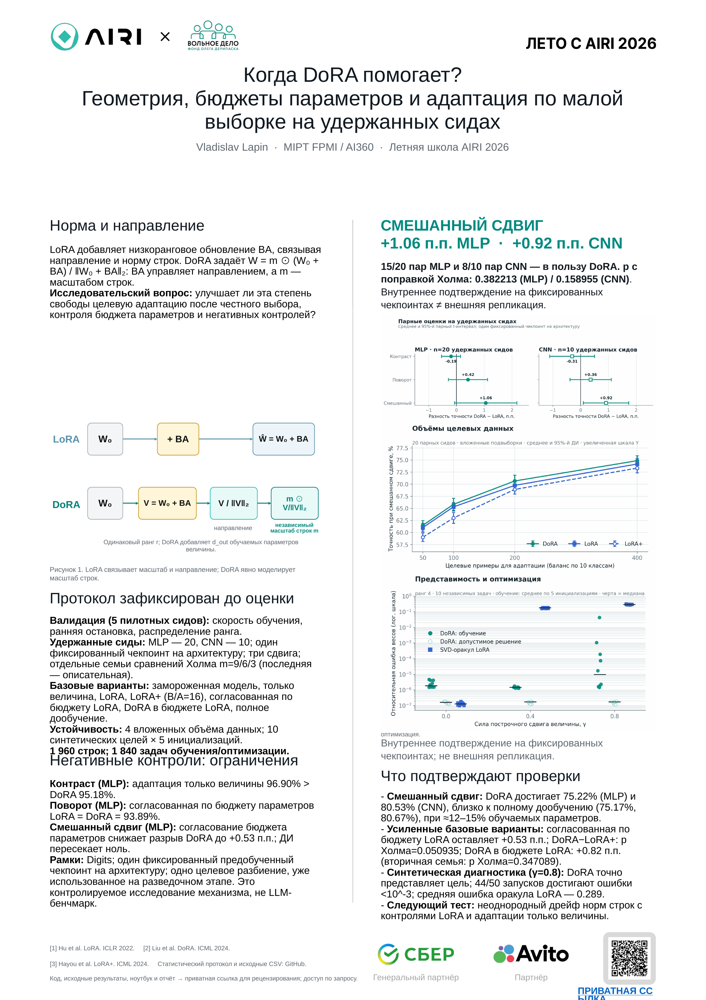

# Когда DoRA помогает?

**Контролируемое исследование представительной способности, оптимизации и адаптации по малой выборке к целевой предметной области для Летней школы AIRI 2026.**

Этот репозиторий превращает первоначальную минимальную проверку корректности на одной матрице (sanity check) во внутреннее подтверждение по зафиксированному протоколу на малых моделях: с более сильными базовыми вариантами, контролем бюджета параметров, второй архитектурой, перебором режимов объёма целевых данных и явным учётом неопределённости.

> **Ответ в одном предложении:** DoRA дала положительные точечные оценки на удержанных сидах, когда целевой сдвиг сочетал изменение направления и неоднородные изменения величины весов, но после поправки на множественность доказательства остаются неубедительными.

## Материалы AIRI

- [Русский плакат формата A1, готовый к печати (PDF)](poster/Lapin_Vladislav_DoRA_AIRI_2026_RU.pdf)
- [Редактируемый русский плакат формата A1 (PPTX)](poster/Lapin_Vladislav_DoRA_AIRI_2026_RU.pptx)
- [Английский плакат формата A1, готовый к печати (PDF)](poster/Lapin_Vladislav_DoRA_AIRI_2026.pdf)
- [Редактируемый английский плакат формата A1 (PPTX)](poster/Lapin_Vladislav_DoRA_AIRI_2026.pptx)
- [Провалидированный ноутбук со встроенными результатами выполнения (запуск в текущем процессе)](notebooks/AIRI_DoRA_confirmatory_study.ipynb)
- [Автономный технический отчёт](report/DoRA_AIRI_technical_report.html)
- [Полное исследовательское повествование](docs/RESEARCH_REPORT.md)
- [Зафиксированный протокол расширенного исследования](docs/EXTENSION_PROTOCOL.md)
- [Русский сценарий защиты и ответы на вопросы](docs/DEFENSE_NOTES.md)



## Ключевые результаты

Для намеренно сложного смешанного сдвига все гиперпараметры и распределения ранга были выбраны по валидации до оценки на целевой тестовой выборке с удержанными сидами (held-seed).

| Базовая архитектура | DoRA | LoRA | LoRA+ | Полное дообучение | DoRA − LoRA, парный 95%-й ДИ |
|---|---:|---:|---:|---:|---:|
| MLP, 20 сидов | **75.22%** | 74.17% | 73.79% | 75.17% | **+1.06 п.п.** [−0.07, +2.18] |
| CNN, 10 сидов | 80.53% | 79.61% | 79.50% | **80.67%** | **+0.92 п.п.** [+0.10, +1.73] |

Результат MLP отдаёт преимущество DoRA в 15/20 парных сидов, а результат CNN — в 8/10. Точные p-значения парного t-критерия составляют `p=0.063702` (MLP) и `p=0.031791` (CNN); после раздельно заявленных поправок Холма они равны `p=0.382213` и `p=0.158955`. Это условные оценки эффекта на одном фиксированном предобученном чекпоинте на каждую архитектуру, а не статистическое подтверждение на уровне семьи сравнений и не внешняя (независимая) репликация.

Дополнительные проверки:

- **Более сильный базовый вариант LoRA:** MLP DoRA превосходит LoRA+ на `+1.43 п.п.`, 95%-й ДИ `[+0.45, +2.41]`; скорректированное методом Холма p-значение парного t-критерия составляет `0.050935`, что выше `0.05`. В LoRA+ используется фиксированное отношение скоростей обучения `B/A=16`; это отношение не настраивалось отдельно для каждого сдвига.
- **Почти согласованный бюджет параметров:** DoRA использует `2,034` обучаемых параметра MLP; выбранное распределение LoRA использует `2,024`. Преимущество DoRA составляет `+0.53 п.п.`, ДИ `[−0.29, +1.35]`, скорректированное методом Холма `p=0.772762`.
- **DoRA в рамках бюджета параметров LoRA:** выбранный вариант DoRA с `1,768` параметрами достигает `74.99%`, а равномерный вариант LoRA с `1,832` параметрами — `74.17%`: `+0.82 п.п.`, ДИ `[−0.22, +1.86]`, исходное `p=0.115696`, скорректированное методом Холма p-значение в отдельной вторичной семье сравнений `p=0.347089`. Это сравнение является описательным и не спасает основное утверждение.
- **Режимы объёма данных:** разность DoRA−LoRA остаётся положительной при 50, 100, 200 и 400 целевых примерах: `+0.46`, `+0.53`, `+0.92` и `+0.69 п.п.`; каждый интервал всё ещё включает ноль.
- **Негативный контроль:** адаптация только величины (magnitude-only) даёт лучший результат на чистом изменении контраста (`96.90%` для MLP), используя лишь `202` обучаемых параметра.
- **Контрпример:** при повороте для MLP согласованные по параметрам LoRA и DoRA обе достигают `93.89%`.

## Что добавлено сверх первоначального проекта

В первоначальном эксперименте использовалась одна синтетическая целевая матрица `8×24`, построенная в семействе DoRA, ранг 4 и три сида. Это полезная минимальная проверка корректности отдельного компонента, но её недостаточно для исследовательского утверждения. В расширении добавлены:

- корректная реализация DoRA для Linear и Conv2d с нормой направления, градиент которой отсоединён;
- базовые варианты LoRA+, адаптация только величины, замороженная модель и полное дообучение;
- почти согласованные по бюджету параметров распределения ранга LoRA и DoRA;
- выбор конфигурации только по валидации на пяти пилотных сидах;
- 20 новых запусков адаптации MLP и 10 новых запусков адаптации CNN на удержанных сидах для каждого заявленного метода и сдвига;
- три спроектированных сдвига предметной области и два семейства базовых архитектур;
- перебор вложенных объёмов целевых данных: 50/100/200/400 примеров;
- обучение синтетической DoRA из стандартной инициализации без эффекта (no-op), а не только допустимая конструкция;
- величины эффекта, t-интервалы, t-критерии, критерии знаковых рангов Уилкоксона и поправка Холма для парных сравнений;
- автоматические проверки покрытия, дубликатов, конфигураций, диапазонов метрик и происхождения результатов;
- `1,960` сохранённых записей запусков расширенного исследования (`1,840` задач обучения/оптимизации) и `11` детерминированных модульных тестов.

Решения и диапазоны сидов были зафиксированы в [`docs/EXTENSION_PROTOCOL.md`](docs/EXTENSION_PROTOCOL.md) до новых запусков на целевой тестовой выборке.

## Дизайн исследования

### Геометрия адаптера

Для замороженной базовой матрицы весов `W₀` LoRA обучает аддитивное обновление ранга `r`:

```text
W_LoRA = W₀ + (α/r)BA
```

DoRA отделяет построчную величину `m` от низкорангового обновления направления:

```text
V = W₀ + (α/r)BA
W_DoRA = m ⊙ V / ||V||row
```

При инициализации `B=0`, а DoRA задаёт `m=||W₀||` по строкам, поэтому оба адаптера начинают работу как точные операции без эффекта. Для `Conv2d` каждый выходной фильтр разворачивается в одну строку до применения низкорангового обновления и величины. Норма направления DoRA отделяется от графа вычислений при обратном распространении, что соответствует опубликованному правилу оптимизации PEFT. Мы используем `α=r`, поэтому масштаб адаптера равен единице.

### Прокси-задача на реальных изображениях

- набор данных: `sklearn.datasets.load_digits`, 1,797 реальных изображений рукописных цифр размером `8×8`;
- фиксированное стратифицированное разбиение: 1,077 исходных обучающих / 360 валидационных / 360 тестовых примеров;
- базовая архитектура MLP: `64 → 128 → 64 → 10`;
- проверка на базовой архитектуре CNN: `Conv(1,16) → Conv(16,32) → 128 → 64 → 10`;
- точность на чистой тестовой выборке: `97.5%` для обеих предобученных базовых моделей;
- целевые сдвиги: контраст, поворот и поворот + контраст + шум;
- пилотные сиды: `11, 22, 33, 44, 55`;
- удержанные сиды адаптации (held-seed): MLP `101..120`, CNN `201..210`;
- выбор: средняя точность на валидации, затем разрешение равенства по валидационному NLL;
- оптимизатор: AdamW, ранняя остановка (early stopping) по валидации, без повторных запусков с учётом тестовой выборки.

### Синтетическая диагностика механизма

Целевая матрица сочетает обновление направления ранга 4 с неоднородным масштабированием строк. LoRA получает свой точный аддитивный оптимум усечённого SVD. DoRA оценивается и как допустимая конструкция, и посредством фактической оптимизации из инициализации без эффекта (no-op).

При силе изменения величины `γ=0.8`:

- средняя относительная ошибка SVD-оракула LoRA: `0.289`;
- ошибка допустимой DoRA: `1.58e−7`;
- средняя ошибка обученной DoRA: `0.00444`;
- доля сошедшихся запусков ниже `1e−3`: `88%` для 10 задач × 5 инициализаций.

Это диагностика представительной способности и оптимизации. Генератор намеренно принадлежит семейству DoRA, поэтому данный результат не является свидетельством на прикладной задаче.

## Карта репозитория

```text
.
├── src/dora_study/                  # адаптеры Linear/Conv2d, MLP/CNN, код данных и синтетики
├── tests/                           # 11 детерминированных проверок корректности
├── results/
│   ├── confirmatory_mlp/            # пилотный выбор + 20 удержанных сидов
│   ├── confirmatory_cnn/            # проверка на второй архитектуре и удержанных сидах
│   ├── data_sweep_mlp/              # вложенный перебор 50/100/200/400 примеров
│   └── synthetic_optimization/      # диагностика обучения и допустимого решения
├── figures/extension/               # материалы для плаката в PNG и SVG
├── notebooks/                       # выполненный ноутбук анализа
├── poster/                          # редактируемые PPTX и печатные PDF AIRI
├── report/                          # проверенный автономный технический HTML-отчёт
├── docs/                            # протокол, отчёт, карта графиков и записи проверок
├── run_confirmatory.py
├── run_data_sweep.py
├── run_synthetic_optimization.py
├── analyze_extension.py
├── analyze_robustness.py
└── make_extension_figures.py
```

## Воспроизведение результатов

Рекомендуется Python 3.10+. Полный запуск совместим с CPU.

```bash
python -m venv .venv
source .venv/bin/activate
python -m pip install -r requirements.txt

# Быстрые проверки корректности и сквозные проверки работоспособности
python -m unittest discover -s tests -v
python run_confirmatory.py --architecture mlp --quick --output-dir /tmp/dora-mlp-smoke
python run_confirmatory.py --architecture cnn --quick --output-dir /tmp/dora-cnn-smoke

# Полное расширение по зафиксированному протоколу (используйте новые каталоги вывода)
python run_confirmatory.py --architecture mlp
python run_confirmatory.py --architecture cnn
python analyze_extension.py
python run_data_sweep.py
python run_synthetic_optimization.py
python analyze_robustness.py
python make_extension_figures.py
python scripts/build_notebook.py
python scripts/build_technical_report.py
python scripts/build_poster_pdf.py  # требуется LibreOffice; также можно экспортировать PPTX в PowerPoint
```

Скрипты запуска экспериментов отказываются записывать данные в непустой каталог результатов. Это не позволяет позднему запуску незаметно смешаться с зафиксированным набором результатов.

## Как читать вывод

Подтверждается:

- разделение величины и направления в DoRA может быть полезно при сложных смешанных сдвигах при примерно 2k обучаемых параметров;
- точечная оценка для смешанного сдвига положительна в оценках MLP и CNN на удержанных сидах и при всех четырёх объёмах целевых данных — условно на фиксированных чекпоинтах и данной модельной задаче;
- одно лишь число параметров не объясняет результат MLP;
- геометрия сдвига имеет значение: адаптация только величины может превосходить другие методы при изменениях контраста, близких к масштабированию.

Не подтверждается:

- что DoRA всегда лучше LoRA;
- что эффект величиной в один процентный пункт (п.п.) на Digits напрямую переносится на LLM;
- что каждое отдельное сравнение является статистически убедительным после поправки на множественность сравнений;
- что один фиксированный предобученный чекпоинт измеряет вариативность предобучения;
- что отношение синтетических ошибок является ожидаемым отношением точности на реальной задаче.

Полная техническая интерпретация приведена в [`docs/RESEARCH_REPORT.md`](docs/RESEARCH_REPORT.md). Аудит калибровки научных утверждений после рецензии находится в [`docs/POST_REVIEW_CALIBRATION.md`](docs/POST_REVIEW_CALIBRATION.md). Машинно сформированные записи контроля качества находятся в [`docs/EXTENSION_VALIDATION.md`](docs/EXTENSION_VALIDATION.md) и [`docs/ROBUSTNESS_VALIDATION.md`](docs/ROBUSTNESS_VALIDATION.md).

## Первоисточники

1. Hu et al. [LoRA: Low-Rank Adaptation of Large Language Models](https://openreview.net/forum?id=nZeVKeeFYf9), ICLR 2022.
2. Liu et al. [DoRA: Weight-Decomposed Low-Rank Adaptation](https://proceedings.mlr.press/v235/liu24bn.html), ICML 2024 Oral.
3. Hayou et al. [LoRA+: Efficient Low Rank Adaptation of Large Models](https://proceedings.mlr.press/v235/hayou24a.html), ICML 2024.
4. Zhang et al. [AdaLoRA: Adaptive Budget Allocation for Parameter-Efficient Fine-Tuning](https://openreview.net/forum?id=lq62uWRJjiY), ICLR 2023.
5. Kalajdzievski. [A Rank Stabilization Scaling Factor for Fine-Tuning with LoRA](https://arxiv.org/abs/2312.03732), 2023.
6. Hugging Face PEFT. [Документация по LoRA и DoRA](https://huggingface.co/docs/peft/package_reference/lora).

Автор: **Vladislav Lapin** · MIPT FPMI / AI360.
