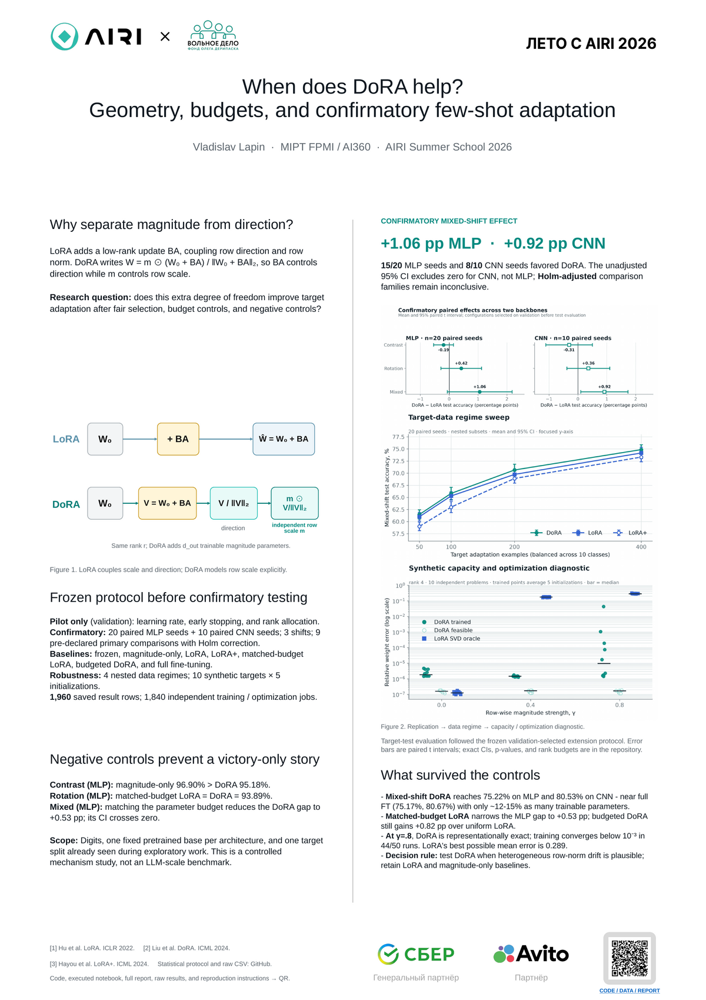

# When does DoRA help?

**A controlled capacity, optimization, and few-shot domain-adaptation study for AIRI Summer School 2026.**

This repository turns an initial single-matrix sanity check into a protocol-frozen small-model study with stronger baselines, parameter-budget controls, a second architecture, a target-data sweep, and explicit uncertainty.

> **Answer in one sentence:** DoRA shows a repeatable practical advantage when the target shift mixes direction and heterogeneous weight-magnitude changes, but the gain is modest, uncertainty remains, and simpler adapters win on simpler shifts.

## AIRI deliverables

- [Print-ready A1 poster (PDF)](poster/Lapin_Vladislav_DoRA_AIRI_2026.pdf)
- [Editable A1 poster (PPTX)](poster/Lapin_Vladislav_DoRA_AIRI_2026.pptx)
- [Executed analysis notebook](notebooks/AIRI_DoRA_confirmatory_study.ipynb)
- [Self-contained technical report](report/DoRA_AIRI_technical_report.html)
- [Full research narrative](docs/RESEARCH_REPORT.md)
- [Frozen extension protocol](docs/EXTENSION_PROTOCOL.md)
- [Russian defense script and Q&A](docs/DEFENSE_NOTES.md)



## Headline evidence

On the deliberately difficult mixed shift, all hyperparameters and rank allocations were selected on validation before confirmatory test evaluation.

| Backbone | DoRA | LoRA | LoRA+ | Full FT | DoRA − LoRA, paired 95% CI |
|---|---:|---:|---:|---:|---:|
| MLP, 20 seeds | **75.22%** | 74.17% | 73.79% | 75.17% | **+1.06 pp** [−0.07, +2.18] |
| CNN, 10 seeds | 80.53% | 79.61% | 79.50% | **80.67%** | **+0.92 pp** [+0.10, +1.73] |

The MLP result favors DoRA in 15/20 paired seeds, and the CNN result in 8/10. These are useful effect estimates, not a universal-win claim: after Holm correction across each declared comparison family, individual p-values are not uniformly below 0.05.

Additional checks:

- **Stronger LoRA baseline:** MLP DoRA exceeds LoRA+ by `+1.43 pp`, 95% CI `[+0.45, +2.41]`; Holm-adjusted paired-t `p=0.0509`.
- **Nearly matched budget:** DoRA uses `2,034` trainable MLP parameters; the selected LoRA allocation uses `2,024`. DoRA is `+0.53 pp`, CI `[−0.29, +1.35]`.
- **LoRA-budget DoRA:** a selected `1,768`-parameter DoRA variant reaches `74.99%`, versus `74.17%` for uniform `1,832`-parameter LoRA.
- **Data regimes:** DoRA−LoRA remains positive at 50, 100, 200, and 400 target examples: `+0.46`, `+0.53`, `+0.92`, and `+0.69 pp`; each interval still includes zero.
- **Negative control:** magnitude-only adaptation is best on pure contrast (`96.90%` MLP) with only `202` trainable parameters.
- **Counterexample:** on MLP rotation, parameter-matched LoRA and DoRA both reach `93.89%`.

## What was added beyond the original project

The original experiment used one `8×24` synthetic target constructed in the DoRA family, rank 4, and three seeds. That is a useful unit sanity check, but not enough evidence for a research claim. The extension adds:

- a correct Linear and Conv2d DoRA implementation with detached directional norm;
- LoRA+, magnitude-only, frozen, and full-fine-tuning baselines;
- nearly parameter-matched LoRA and DoRA rank allocations;
- validation-only configuration selection on five pilot seeds;
- 20 new MLP and 10 new CNN confirmatory seeds;
- three designed domain shifts and two backbone families;
- a nested 50/100/200/400-example target-data sweep;
- trained synthetic DoRA from its standard no-op initialization, not only a feasible construction;
- paired effect sizes, t intervals, t-tests, Wilcoxon tests, and Holm correction;
- automatic coverage, duplicate, configuration, metric-range, and provenance checks;
- `1,960` saved extension run records (`1,840` actual training/optimization jobs) and `11` deterministic unit tests.

The decisions and seed ranges were frozen in [`docs/EXTENSION_PROTOCOL.md`](docs/EXTENSION_PROTOCOL.md) before the new target-test runs.

## Study design

### Adapter geometry

For a frozen base weight `W₀`, LoRA learns a rank-`r` additive update:

```text
W_LoRA = W₀ + (α/r)BA
```

DoRA separates row magnitude `m` from a low-rank directional update:

```text
V = W₀ + (α/r)BA
W_DoRA = m ⊙ V / ||V||row
```

`B=0` at initialization, so both adapters start as exact no-ops. The DoRA directional norm is detached during backpropagation, matching the published/PEFT optimization rule. We use `α=r`, so the adapter scale equals one.

### Real-image proxy

- dataset: `sklearn.datasets.load_digits`, 1,797 real `8×8` handwritten-digit images;
- fixed stratified split: 1,077 source train / 360 validation / 360 test;
- MLP backbone: `64 → 128 → 64 → 10`;
- CNN replication: `Conv(1,16) → Conv(16,32) → 128 → 64 → 10`;
- clean test accuracy: `97.5%` for both pretrained bases;
- target shifts: contrast, rotation, and rotation + contrast + noise;
- pilot seeds: `11, 22, 33, 44, 55`;
- confirmatory seeds: MLP `101..120`, CNN `201..210`;
- selection: mean validation accuracy, then validation NLL tie-break;
- optimizer: AdamW, validation early stopping, no test-informed reruns.

### Synthetic mechanism diagnostic

The target combines a rank-4 directional update with heterogeneous row scaling. LoRA receives its exact truncated-SVD additive optimum. DoRA is evaluated both as a feasible construction and by actual optimization from the no-op initialization.

At magnitude strength `γ=0.8`:

- LoRA SVD oracle mean relative error: `0.289`;
- feasible DoRA error: `1.58e−7`;
- trained DoRA mean error: `0.00444`;
- convergence below `1e−3`: `88%` across 10 problems × 5 initializations.

This is a capacity/optimization diagnostic. The generator intentionally belongs to the DoRA family, so it is not downstream evidence.

## Repository map

```text
.
├── src/dora_study/                  # Linear/Conv2d adapters, MLP/CNN, data and synthetic code
├── tests/                           # 11 deterministic correctness tests
├── results/
│   ├── confirmatory_mlp/            # pilot selection + 20-seed confirmation
│   ├── confirmatory_cnn/            # architecture replication
│   ├── data_sweep_mlp/              # nested 50/100/200/400-example sweep
│   └── synthetic_optimization/      # trained-vs-feasible mechanism diagnostic
├── figures/extension/               # poster-ready PNG + SVG evidence
├── notebooks/                       # executed analysis companion
├── poster/                          # editable AIRI PPTX and print PDF
├── report/                          # validated, self-contained technical HTML report
├── docs/                            # protocol, report, chart map, and validation records
├── run_confirmatory.py
├── run_data_sweep.py
├── run_synthetic_optimization.py
├── analyze_extension.py
├── analyze_robustness.py
└── make_extension_figures.py
```

## Reproduce

Python 3.10+ is recommended. Full execution is CPU-compatible.

```bash
python -m venv .venv
source .venv/bin/activate
python -m pip install -r requirements.txt

# Fast correctness and end-to-end smoke checks
python -m unittest discover -s tests -v
python run_confirmatory.py --architecture mlp --quick --output-dir /tmp/dora-mlp-smoke
python run_confirmatory.py --architecture cnn --quick --output-dir /tmp/dora-cnn-smoke

# Full protocol-frozen extension (use fresh output directories)
python run_confirmatory.py --architecture mlp
python run_confirmatory.py --architecture cnn
python analyze_extension.py
python run_data_sweep.py
python run_synthetic_optimization.py
python analyze_robustness.py
python make_extension_figures.py
python scripts/build_notebook.py
python scripts/build_technical_report.py
python scripts/build_poster_pdf.py  # requires LibreOffice or export the PPTX in PowerPoint
```

The experiment runners refuse to write into a non-empty output directory. This prevents a later run from silently mixing with the frozen result set.

## How to read the conclusion

Supported:

- DoRA's magnitude/direction decomposition can be useful under complex mixed shifts at roughly 2k trainable parameters.
- The mixed-shift point estimate is consistent across MLP, CNN, and all four target-data budgets.
- Parameter count alone does not explain the MLP result.
- Shift geometry matters: magnitude-only can dominate on scale-like contrast changes.

Not supported:

- that DoRA is always better than LoRA;
- that a one-percentage-point Digits effect transfers directly to LLMs;
- that every individual comparison is statistically decisive after multiplicity correction;
- that one fixed pretrained checkpoint measures pretraining variability;
- that the synthetic error ratio is an expected real-task accuracy ratio.

The full technical interpretation is in [`docs/RESEARCH_REPORT.md`](docs/RESEARCH_REPORT.md). Machine-generated QA records are in [`docs/EXTENSION_VALIDATION.md`](docs/EXTENSION_VALIDATION.md) and [`docs/ROBUSTNESS_VALIDATION.md`](docs/ROBUSTNESS_VALIDATION.md).

## Primary sources

1. Hu et al. [LoRA: Low-Rank Adaptation of Large Language Models](https://openreview.net/forum?id=nZeVKeeFYf9), ICLR 2022.
2. Liu et al. [DoRA: Weight-Decomposed Low-Rank Adaptation](https://proceedings.mlr.press/v235/liu24bn.html), ICML 2024 Oral.
3. Hayou et al. [LoRA+: Efficient Low Rank Adaptation of Large Models](https://proceedings.mlr.press/v235/hayou24a.html), ICML 2024.
4. Zhang et al. [AdaLoRA: Adaptive Budget Allocation for Parameter-Efficient Fine-Tuning](https://openreview.net/forum?id=lq62uWRJjiY), ICLR 2023.
5. Kalajdzievski. [A Rank Stabilization Scaling Factor for Fine-Tuning with LoRA](https://arxiv.org/abs/2312.03732), 2023.
6. Hugging Face PEFT. [LoRA and DoRA documentation](https://huggingface.co/docs/peft/package_reference/lora).

Author: **Vladislav Lapin** · MIPT FPMI / AI360.
